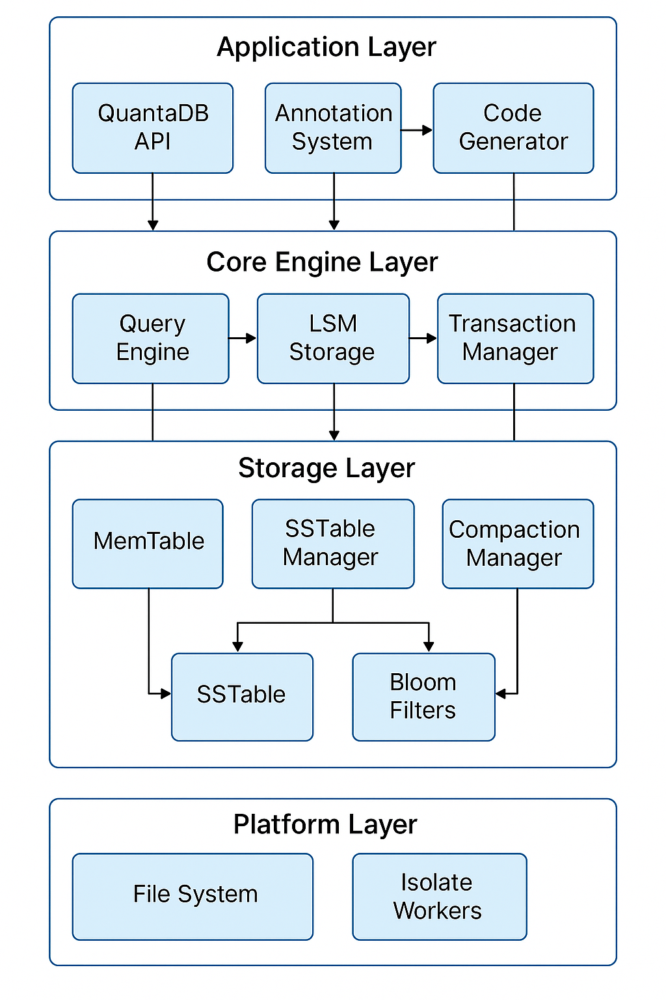
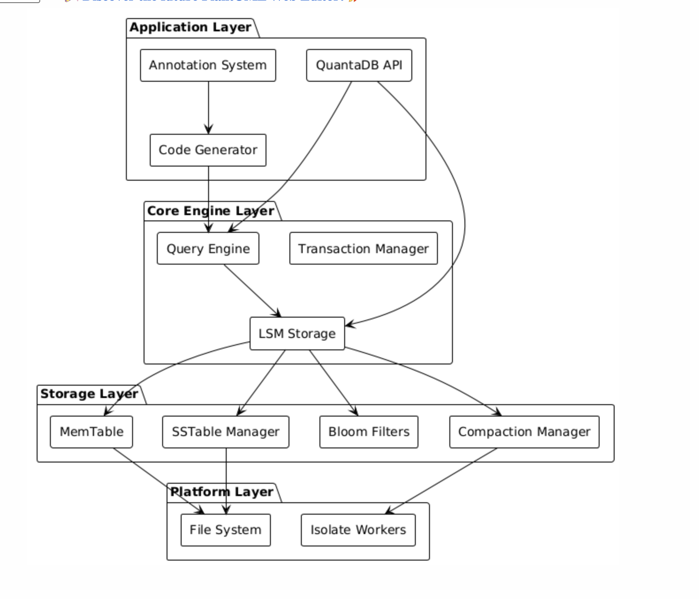

# QuantaDB: A High-Performance Pure Dart Local Database

**⚠️ Warning: This project is currently in beta development. Use accordingly for development and testing purposes.**

QuantaDB is a modern, high-performance **NoSQL** local database built entirely in Dart. It's designed to provide a fast, reliable, and easy-to-use data storage solution for both Flutter applications and pure Dart projects.

## Why QuantaDB?

Existing local databases for Dart/Flutter often have external dependencies or performance limitations. QuantaDB aims to overcome these challenges by implementing a Log-Structured Merge Tree (LSM-Tree) storage engine from scratch in pure Dart, coupled with an annotation-driven code generation system for a developer-friendly experience.

Our goals include:
- Achieving competitive read and write performance.
- Providing a simple and intuitive API.
- Ensuring data durability and consistency.
- Supporting complex data models with relationships and indexing.
- Offering a reactive query system for real-time updates.

## Architecture

QuantaDB is built with a layered architecture to separate concerns and improve maintainability. The core of the database is the LSM-Tree storage engine.

### High-Level Architecture

Below is a high-level overview of the QuantaDB architecture:



- **Application Layer**: Provides the public API and integrates with the annotation and code generation systems.
- **Core Engine Layer**: Contains the central logic for query processing, LSM storage management, and transactions.
- **Storage Layer**: Implements the core storage components like MemTable, SSTable Manager, Bloom Filters, and Compaction.
- **Platform Layer**: Interacts with the underlying file system and utilizes isolate workers for background tasks.

### Data Flow

Here's a diagram illustrating the typical data flow within QuantaDB:



- Data enters through the API.
- Queries are processed by the Query Engine.
- Write operations go through the MemTable and are eventually flushed to SSTables.
- Read operations utilize Bloom Filters and the MemTable before hitting SSTables.
- Compaction runs in the background to merge and optimize SSTables.

## Getting Started

### Installation

1. **Depend on it**

Add this to your package's `pubspec.yaml` file:

```yaml
dependencies:
  quanta_db: ^0.0.1
```

2. **Install it**

You can install packages from the command line:

```bash
$ dart pub get
```

3. **Import it**

Now in your Dart code, you can use:

```dart
import 'package:quanta_db/quanta_db.dart';
```

### Usage

Import the package and open a database. QuantaDB automatically handles platform-specific secure directory management for both Flutter and pure Dart environments.

```dart
import 'package:quanta_db/quanta_db.dart';

void main() async {
  // Open the database
  // The database files will be stored in a platform-specific secure location
  final db = await QuantaDB.open('my_database');

  // Put some data
  await db.put('my_key', {'name': 'Quanta', 'version': 1.0});

  // Get data
  final data = await db.get('my_key');
  print('Retrieved data: $data');

  // Update data
  await db.put('my_key', {'name': 'QuantaDB', 'version': 1.1});
  final updatedData = await db.get('my_key');
  print('Updated data: $updatedData');

  // Delete data
  await db.delete('my_key');
  final deletedData = await db.get('my_key');
  print('Deleted data: $deletedData');

  // Close the database
  await db.close();
}
```

**Tips:**

*   QuantaDB is a **NoSQL** database, using a key-value store model based on LSM-Trees.
*   Data is stored using a custom binary serialization format (DartBson).
*   Directory management is handled automatically for different platforms, ensuring secure storage locations.

## Contributing

We welcome contributions! Please see the [CONTRIBUTING.md](CONTRIBUTING.md) for details.

## License

This project is licensed under the [MIT License](LICENSE).

---

*Note: This project is currently under active development. Features and APIs may change.*
